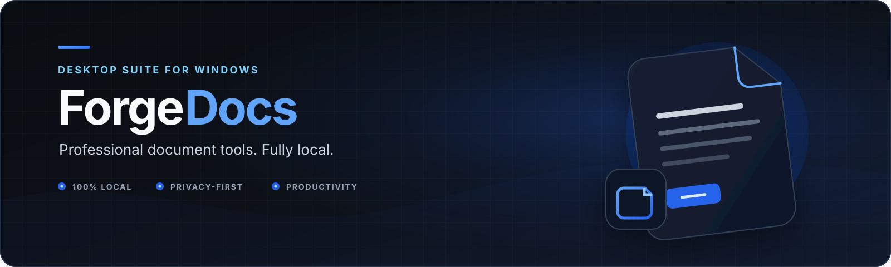
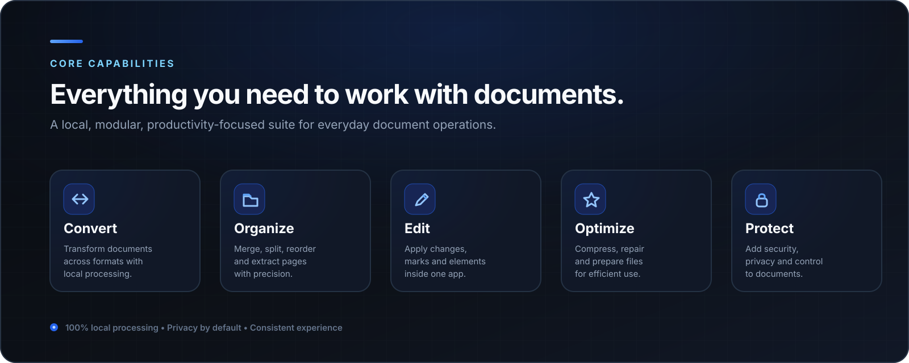
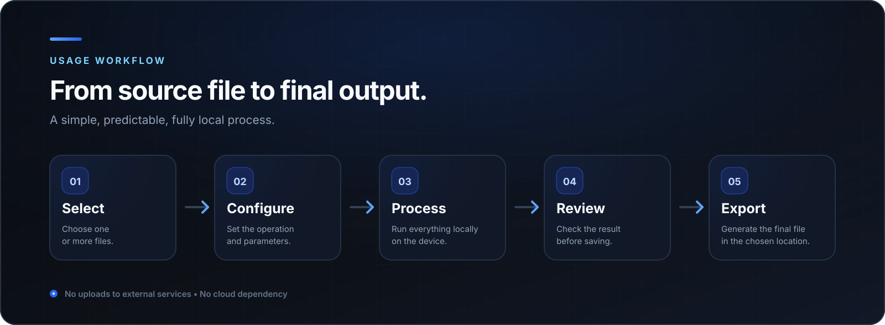
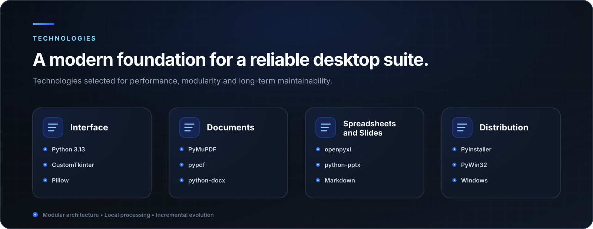
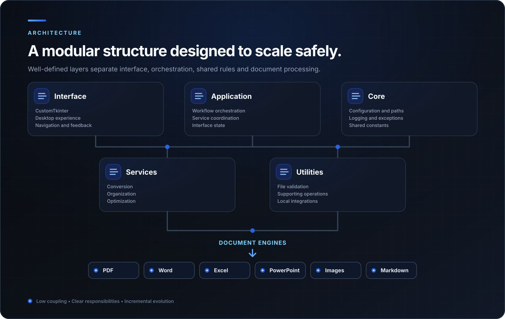
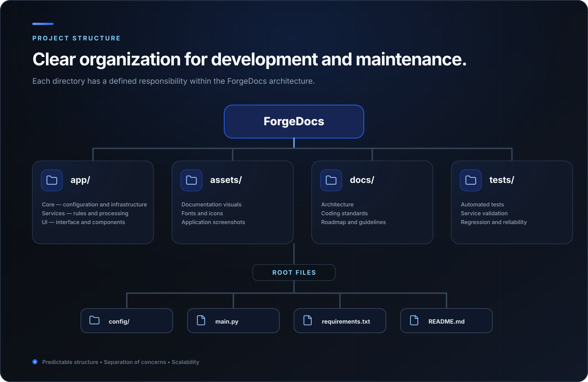
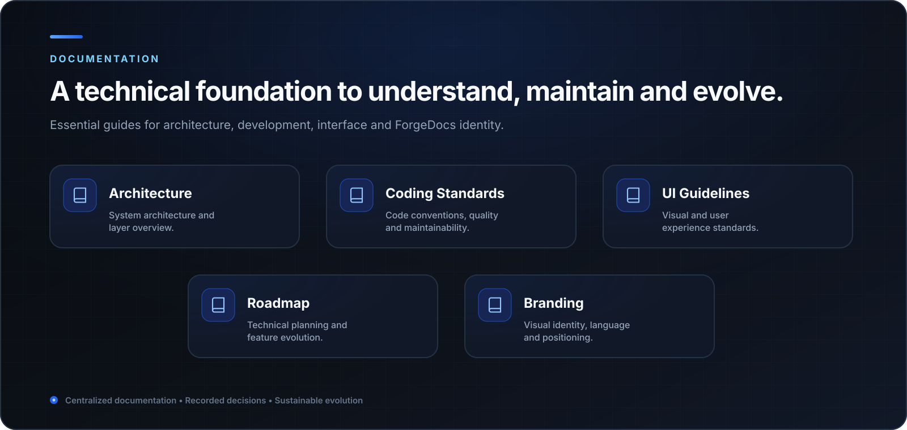
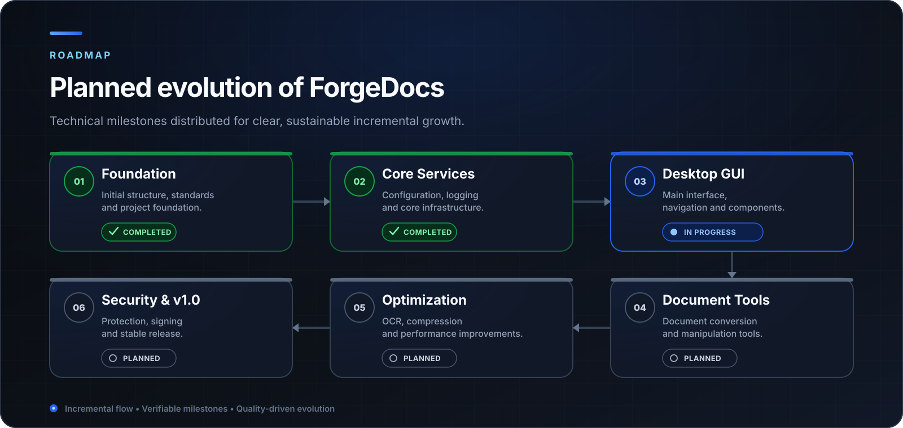
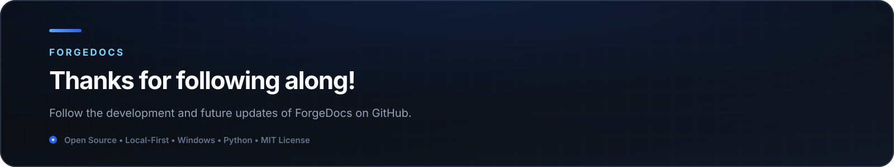

  

  
  
  
  
  

# **ForgeDocs**

> **Professional desktop suite for document management on Windows.**

**ForgeDocs** is a desktop suite designed to centralize document conversion, organization, optimization, and security into a single modern application running **100% locally**.

Built with privacy, performance, and scalability in mind, ForgeDocs keeps files under the user's control throughout the entire processing workflow while continuously evolving through a modular architecture designed for future expansion.

---

## **Why ForgeDocs?**

  

ForgeDocs brings together the most common document management tools in a single application, combining privacy, performance, and a consistent user experience.

Designed for professionals, students, and organizations, it eliminates the need to switch between multiple online services and standalone applications by centralizing everyday document operations in a modern desktop environment.

### Project Principles

- **Privacy First** — All processing is performed locally, keeping documents entirely under the user's control.
- **Modular Architecture** — Designed for continuous growth and straightforward maintenance.
- **Consistent Experience** — A unified interface and standardized behavior across every tool in the suite.
- **Open Source** — Developed transparently with comprehensive documentation and industry best practices.

---

## **Workflow**

  

ForgeDocs is designed to provide a simple, predictable, and consistent workflow. Every tool follows the same operational logic, reducing the learning curve while delivering a unified experience throughout the application.

Regardless of the selected feature, the objective remains the same: enable users to complete tasks quickly, efficiently, and with as few steps as possible.

---

## **Technology Stack**

  

ForgeDocs is built on mature technologies from the Python ecosystem, prioritizing well-established libraries that are widely adopted and actively maintained.

The technology stack is guided by three core principles: stability, performance, and maintainability, allowing the project to evolve continuously without compromising code quality or user experience.

### Technology Philosophy

- **Python at its Core** — A mature ecosystem with excellent productivity and strong support for desktop applications.
- **Specialized Components** — Each library solves a specific problem, reducing complexity while improving reliability.
- **Sustainable Growth** — Stable and widely adopted technologies minimize risks throughout the project's evolution.

---

## **Architecture**

  

ForgeDocs follows a modular architecture designed to separate responsibilities, reduce coupling, and support the independent evolution of each application component.

This approach enables new tools, services, and integrations to be introduced without affecting the stability of the existing core while improving testing, maintenance, and code reuse.

### Architectural Principles

- **Separation of Concerns** — Each layer has a clearly defined responsibility.
- **Low Coupling** — Modules remain as independent as possible, minimizing the impact of future changes.
- **Reusable Components** — Services and interface elements can be shared across multiple tools.
- **Incremental Evolution** — New features can be introduced gradually without requiring major architectural changes.

---

## **Project Structure**

  

ForgeDocs is organized to maintain a clear separation between the user interface, business logic, services, and application resources. This structure improves maintainability, reduces development complexity, and supports the project's long-term evolution.

In addition to making the repository easier to navigate for new contributors, the modular organization encourages consistent testing, component reuse, and predictable future expansion.

### Repository Organization

- **Centralized Source Code** — The application is organized into independent modules with clearly defined responsibilities.
- **Isolated Resources** — Icons, images, fonts, and other static assets remain separated from application logic.
- **Integrated Documentation** — Development guides, coding standards, and the roadmap are maintained alongside the source code.
- **Built for Growth** — The structure supports new features without compromising the existing organization.

---

## **Documentation**

  

Documentation is treated as an integral part of ForgeDocs development. Architecture, coding standards, interface guidelines, and planning evolve together with the application, ensuring technical consistency throughout the project's lifecycle.

This approach simplifies collaboration, reduces the onboarding process for new contributors, and ensures that important technical decisions remain documented and easily accessible.

### Documentation Areas

- **Architecture** — Technical organization, components, and application responsibilities.
- **Coding Standards** — Development conventions, project organization, and best practices.
- **UI Guidelines** — Visual definitions and principles for a consistent user experience.
- **Roadmap** — Planned features and long-term project evolution.

---

## **Roadmap**

  

ForgeDocs follows an incremental development roadmap focused on stability, quality, and continuous improvement. Every feature is introduced only after the underlying foundation has been consolidated, ensuring a robust and sustainable desktop suite.

This strategy enables the application to expand gradually while maintaining compatibility between modules, reducing development risks, and preserving a consistent user experience.

### Project Direction

- **Incremental Development** — New features are delivered through well-defined implementation stages.
- **Quality over Quantity** — Platform stability always takes priority over rapid feature delivery.
- **Scalable Architecture** — Designed to accommodate new tools without significant restructuring.
- **Continuous Evolution** — The roadmap remains a living document that grows alongside the project.

---

  

  Developed by <strong>Arthur Franklin</strong> ·
  <a href="README.md">Leia em Português</a> ·
  <a href="LICENSE">MIT License</a>

---
