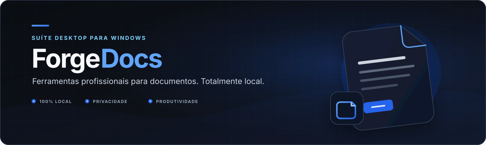
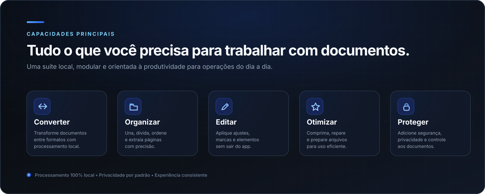
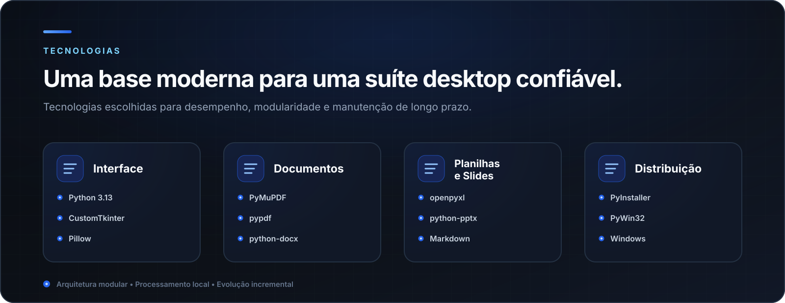
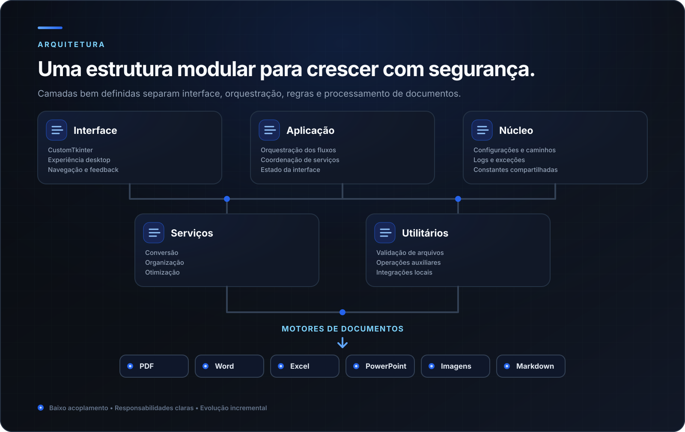
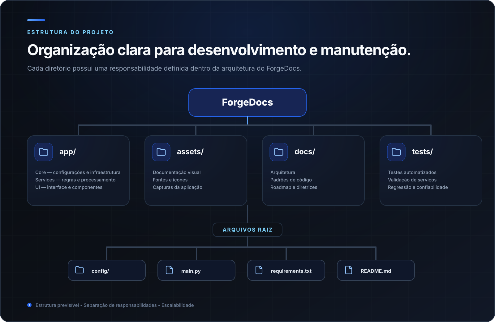
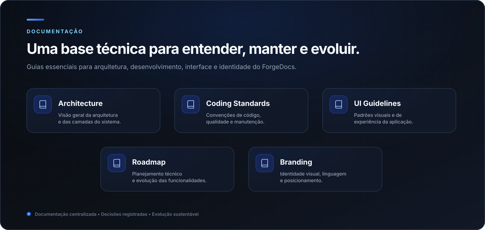
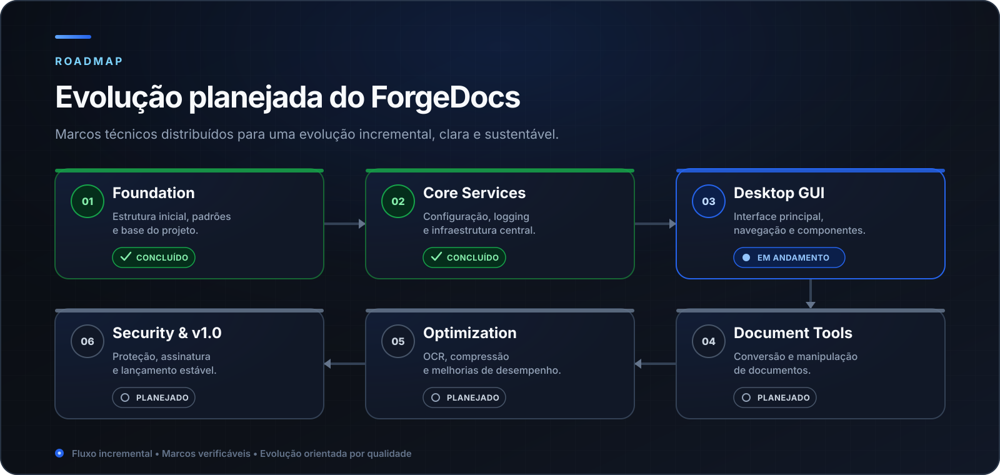
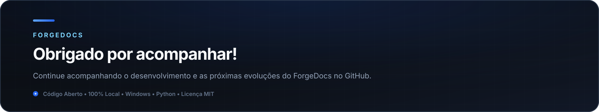

  

  
  
  
  
  

# **ForgeDocs**

> **Suíte desktop profissional para manipulação de documentos no Windows.**

O **ForgeDocs** é uma suíte desktop desenvolvida para centralizar tarefas de conversão, organização, otimização e segurança de documentos em uma única aplicação moderna, executada **100% localmente**.

Projetado com foco em privacidade, desempenho e escalabilidade, o ForgeDocs mantém os arquivos sob controle do usuário durante todo o processamento e evolui continuamente por meio de uma arquitetura modular preparada para novas funcionalidades.

---

## **Por que o ForgeDocs?**

  

O ForgeDocs reúne as ferramentas mais utilizadas na manipulação de documentos em uma única aplicação, combinando privacidade, desempenho e uma experiência consistente.

Projetado para profissionais, estudantes e organizações, o projeto elimina a necessidade de alternar entre diversos serviços online e aplicações distintas, centralizando operações frequentes em um ambiente desktop moderno.

### Princípios do projeto

- **Privacidade em primeiro lugar** — Todo o processamento é realizado localmente, mantendo os documentos sob controle do usuário.
- **Arquitetura modular** — Estrutura preparada para crescimento contínuo e fácil manutenção.
- **Experiência consistente** — Interface unificada e comportamento padronizado em todas as ferramentas da suíte.
- **Código aberto** — Projeto open source, desenvolvido de forma transparente, documentado e orientado por boas práticas.

---

## **Fluxo de Trabalho**

  

O ForgeDocs foi projetado para oferecer um fluxo de trabalho simples, previsível e consistente. Cada ferramenta segue a mesma lógica operacional, reduzindo a curva de aprendizado e proporcionando uma experiência uniforme em toda a aplicação.

Independentemente da funcionalidade utilizada, o objetivo é permitir que o usuário execute tarefas de forma rápida, organizada e com o mínimo de etapas necessárias.

---

## **Tecnologias do Produto**

  

O ForgeDocs é desenvolvido sobre tecnologias consolidadas do ecossistema Python, priorizando bibliotecas maduras, amplamente adotadas e mantidas pela comunidade.

A seleção da stack foi orientada por três pilares: estabilidade, desempenho e facilidade de manutenção, permitindo que o projeto evolua continuamente sem comprometer a qualidade do código ou a experiência do usuário.

### Filosofia tecnológica

- **Python como base** — Ecossistema maduro, produtividade elevada e excelente suporte para aplicações desktop.
- **Componentes especializados** — Cada biblioteca é utilizada para resolver um problema específico, reduzindo complexidade e aumentando a confiabilidade.
- **Evolução sustentável** — A stack privilegia tecnologias estáveis e amplamente utilizadas, reduzindo riscos durante o crescimento do projeto.

---

## **Arquitetura**

  

A arquitetura do ForgeDocs foi estruturada para separar responsabilidades, reduzir acoplamento e facilitar a evolução independente de cada componente da aplicação.

Essa organização permite que novas ferramentas, serviços e integrações sejam adicionados sem comprometer a estabilidade do núcleo existente, além de favorecer testes, manutenção e reutilização de código.

### Princípios arquiteturais

- **Separação de responsabilidades** — Cada camada possui uma função bem definida dentro da aplicação.
- **Baixo acoplamento** — Os módulos dependem o mínimo possível uns dos outros, reduzindo impactos durante alterações.
- **Reutilização de componentes** — Serviços e elementos de interface podem ser compartilhados entre diferentes ferramentas.
- **Evolução incremental** — Novas funcionalidades podem ser incorporadas de forma controlada, sem exigir grandes reestruturações.

---

## **Estrutura do Projeto**

  

A organização do ForgeDocs foi concebida para manter uma separação clara entre interface, lógica de negócio, serviços e recursos da aplicação. Essa estrutura favorece a manutenção do código, reduz a complexidade do desenvolvimento e facilita a evolução contínua do projeto.

Além de tornar a navegação mais intuitiva para novos colaboradores, a organização modular contribui para testes mais consistentes, reutilização de componentes e maior previsibilidade durante futuras expansões.

### Organização do repositório

- **Código-fonte centralizado** — A aplicação é organizada em módulos independentes, com responsabilidades bem definidas.
- **Recursos isolados** — Ícones, imagens, fontes e demais arquivos estáticos permanecem separados da lógica da aplicação.
- **Documentação integrada** — Guias, padrões de desenvolvimento e roadmap fazem parte do próprio repositório, garantindo rastreabilidade.
- **Preparado para crescimento** — A estrutura permite adicionar novas funcionalidades sem comprometer a organização existente.

---

## **Documentação**

  

A documentação do ForgeDocs é tratada como parte integrante do desenvolvimento. Arquitetura, padrões de código, diretrizes de interface e planejamento evoluem em conjunto com a aplicação, garantindo consistência técnica ao longo de todo o ciclo de vida do projeto.

Essa abordagem facilita a colaboração, reduz a curva de aprendizado para novos contribuidores e assegura que decisões importantes permaneçam registradas e acessíveis durante a evolução da suíte.

### Áreas Documentadas

- **Arquitetura** — Organização técnica, componentes e responsabilidades da aplicação.
- **Padrões de desenvolvimento** — Convenções de código, organização do projeto e boas práticas.
- **Diretrizes de interface** — Definições visuais e princípios para uma experiência consistente.
- **Roadmap** — Planejamento das funcionalidades e evolução prevista do projeto.

---

## **Roadmap**

  

O desenvolvimento do ForgeDocs segue um roadmap incremental, estruturado em etapas que priorizam estabilidade, qualidade e evolução contínua. Cada funcionalidade é incorporada somente após a consolidação da base existente, garantindo uma suíte robusta e preparada para crescer de forma sustentável.

Essa estratégia permite expandir gradualmente as capacidades da aplicação, mantendo compatibilidade entre módulos, reduzindo riscos durante o desenvolvimento e preservando a consistência da experiência oferecida ao usuário.

### Direcionamento do Projeto

- **Desenvolvimento incremental** — Novas funcionalidades são implementadas em etapas bem definidas.
- **Qualidade antes da quantidade** — A estabilidade da plataforma tem prioridade sobre a velocidade de entrega.
- **Arquitetura escalável** — O projeto é preparado para suportar novas ferramentas sem reestruturações significativas.
- **Evolução contínua** — O roadmap permanece vivo, acompanhando a maturidade do projeto e as necessidades futuras.

---

  

  Desenvolvido por <strong>Arthur Franklin</strong> ·
  <a href="README.en.md">Read in English</a> ·
  <a href="LICENSE">Licença MIT</a>

---
