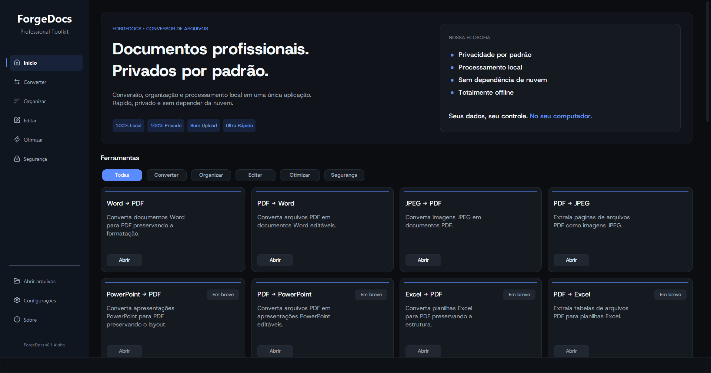

# ForgeDocs

Local-first document processing suite for Windows, built with Python.


## Overview

ForgeDocs is a desktop suite designed to centralize common document processing tasks in a single Windows application.

The project focuses on conversion, organization, editing, optimization, and document protection while keeping processing local to the user's device. Files remain under the user's control throughout the workflow, without depending on external cloud services for processing.

ForgeDocs follows a modular architecture designed to support continuous development, maintainability, and the addition of new document tools over time.

## Features

ForgeDocs is being developed around five main areas:

- **Convert** — Transform documents between supported formats.
- **Organize** — Join, split, reorder, and extract document content.
- **Edit** — Apply adjustments, annotations, and other supported modifications.
- **Optimize** — Compress, repair, and prepare files for efficient use.
- **Protect** — Add security and privacy controls to supported documents.

All tools follow a consistent workflow:

**Select → Configure → Process → Review → Export**

Processing is performed locally, without requiring uploads to external services.

## Screenshot

<p align="center">
  
</p>

## Tech Stack

| Area | Technologies |
| --- | --- |
| Core | Python 3.13 |
| Interface | CustomTkinter, Pillow |
| PDF & Documents | PyMuPDF, pypdf, python-docx |
| Spreadsheets & Presentations | openpyxl, python-pptx |
| Other Formats | Markdown |
| Distribution | PyInstaller, PyWin32 |
| Platform | Windows |

The stack is centered around established Python libraries, with each component responsible for a specific part of the document-processing workflow.

## Architecture

ForgeDocs is organized around clearly separated responsibilities to reduce coupling and make individual components easier to maintain and extend.

The main architectural areas are:

- **Interface** — Desktop UI, navigation, and user feedback.
- **Application** — Workflow orchestration and service coordination.
- **Core** — Shared configuration, paths, logging, and exceptions.
- **Services** — Document conversion, organization, editing, and optimization.
- **Utilities** — File validation, auxiliary operations, and local integrations.
- **Document Engines** — Format-specific processing for PDF, Word, Excel, PowerPoint, images, and Markdown.

This separation allows new tools and integrations to be introduced without requiring major changes to the existing application structure.

## Project Structure

The repository is organized around the following main areas:

```text
ForgeDocs/
├── app/
│   ├── core/
│   ├── services/
│   ├── ui/
│   │   ├── components/
│   │   ├── data/
│   │   ├── pages/
│   │   └── resources/
│   └── application.py
├── assets/
│   ├── fonts/
│   ├── icons/
│   └── images/
├── config/
├── docs/
├── scripts/
├── tests/
├── main.py
├── requirements.txt
└── README.md
```

- `app/` contains the application source code and its main modules.
- `assets/` stores static resources used by the project.
- `docs/` contains technical and project documentation.
- `tests/` contains automated tests and service validation.
- `config/` contains project configuration.
- `main.py` provides the application entry point.
- `requirements.txt` defines the Python dependencies.

## Getting Started

### Requirements

- Windows
- Python 3.13
- Project dependencies listed in `requirements.txt`

### Installation

Clone the repository:

```bash
git clone https://github.com/arthurcfranklin/forgedocs.git
cd forgedocs
```

Create and activate a virtual environment, then install the project dependencies.

> The exact development setup and execution commands should follow the current project configuration.

### Running

ForgeDocs is currently under active development.

Development and execution instructions will be documented here as the application workflow stabilizes.

## Documentation

Technical documentation is maintained inside the `docs/` directory and evolves alongside the application.

Current documentation areas include:

- **Architecture** — System organization, components, and responsibilities.
- **Coding Standards** — Code conventions and development practices.
- **UI Guidelines** — Visual and interaction standards for the desktop application.
- **Roadmap** — Technical planning and upcoming development milestones.
- **Branding** — Project identity and visual guidelines.

## Roadmap

- [x] Foundation
- [x] Core Services
- [ ] Desktop GUI
- [ ] Document Tools
- [ ] Optimization
- [ ] Security & v1.0

Development follows an incremental approach, prioritizing a stable foundation before expanding the application's feature set.

## Project Principles

- **Local-first** — Document processing remains on the user's device.
- **Modular architecture** — Components have clear and independent responsibilities.
- **Consistent experience** — Tools follow shared interface and workflow patterns.
- **Maintainability** — The project favors clear structure and established technologies.
- **Incremental development** — Features are introduced as the underlying platform matures.
- **Open source** — Development remains transparent and documented.

---

Developed by **Arthur Franklin** · [Português](README.pt-BR.md) · [MIT License](LICENSE)
